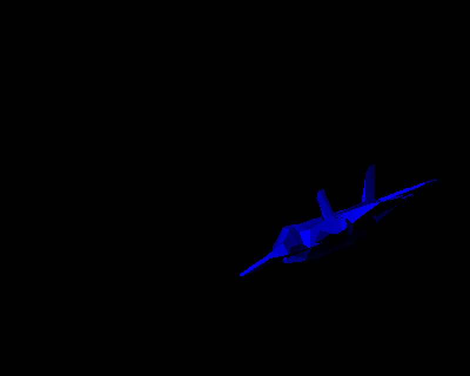
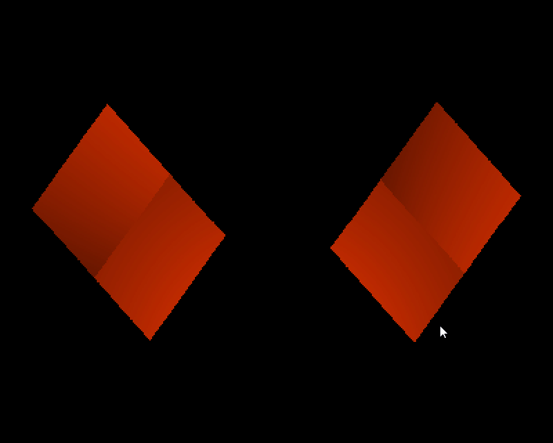
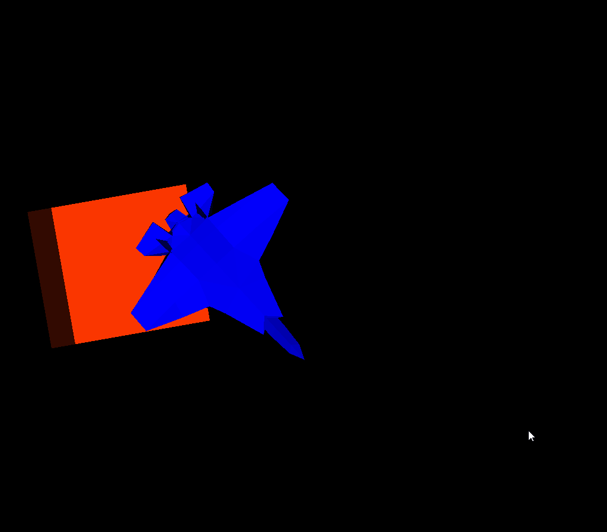

# Rust 3D game test engine

1. ~~Work only with wavefront obj files~~
2. Don't use directly OpenGL, Vulkan or others 3D libraries
3. Without textures
----------------------
## TODO :D
----------------------
- [x] Drawing a cube
- [x] Load Wavefront files
    - [ ] ~~Loading all data~~
    - [x] Ambient, diffuse, diffuse
    - [x] Vertices
    - [x] Normals
    - [ ] ~~Textures~~
        - [x] ~~Texture image~~
        - [x] ~~Texture Coordinates~~
        - [ ] ~~Understand how to match both~~

- [ ] Load gltf/gltb files
- [x] Understand the translation transformation
- [x] Make rotations

- [ ] Shading
    - [ ] Enhance my shader
        - [x] diffuse shader
        - [ ] Specular shader
    - [x] ~~Textures~~
        - [x] Draw texture on cube
        - [ ] ~~Draw it correctly~~
        - [ ] ~~Understand how to draw it correctly~~

    - [x] Ambient, diffuse, specular
    
- [ ] ~~Using GPU instead of CPU~~
- [ ] Moving through the world
    - [x] X axis and Z axis
    - [ ] rotate camera
    - [ ] move with rotated camera
----------------------

| Airplane test success |
| ---------------- |
|  |

| Two cubes ! |
| ----------- |
|  |

| Both ! |
| ----------- |
|  |

