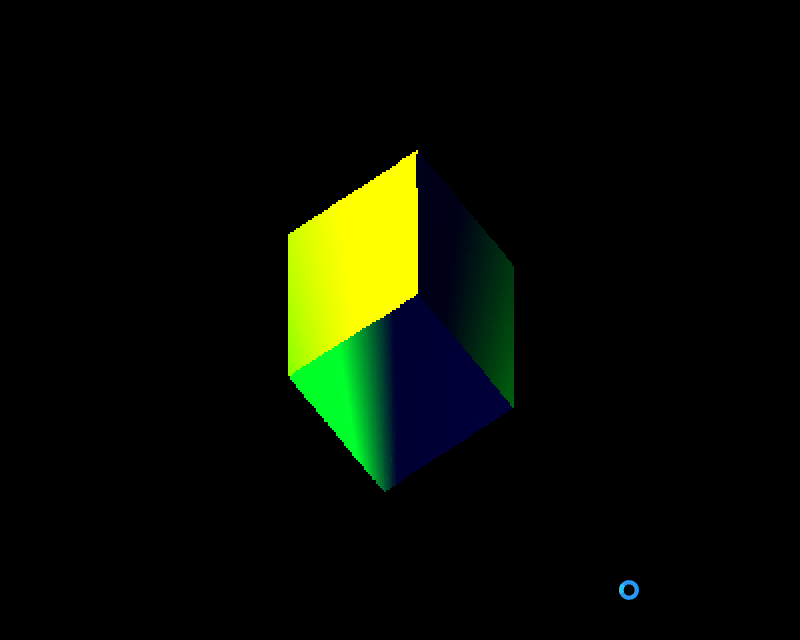

# Rust 3D game test engine

1. Work with the Phong model shader
2. ~~Work only with wavefront obj files~~
3. Don't use directly OpenGL, Vulkan or others 3D libraries
4. Without textures
----------------------
## TODO :D
----------------------
- [x] Drawing a cube
- [x] Load Wavefront files
    - [ ] ~~Loading all data~~
    - [x] Ambient, diffuse, diffuse
    - [x] Vertices
    - [x] Normals
    - [ ] ~~Textures~~
        - [x] ~~Texture image~~
        - [x] ~~Texture Coordinates~~
        - [ ] ~~Understand how to match both~~

- [ ] Load gltf/gltb files
- [ ] Understand the translation transformation
- [x] Make rotations

- [ ] Shading with Phong model
    - [ ] Enhance my shader
    - [ ] ~~Textures~~
        - [x] Draw texture on cube
        - [ ] ~~Draw it correctly~~
        - [ ] ~~Understand how to draw it correctly~~

    - [x] Ambient, diffuse, specular
    
- [ ] ~~Using GPU instead of CPU~~
- [ ] Moving through the world
----------------------

| First shader | Specular shading |
| ----------------- | -------------------- |
|  |  |

| Airplane failed test | Airplane test success |
| --------------------- | ---------------- |
|  |  |

| Failed texture mapping | 
| ---------------------- |
|  |
