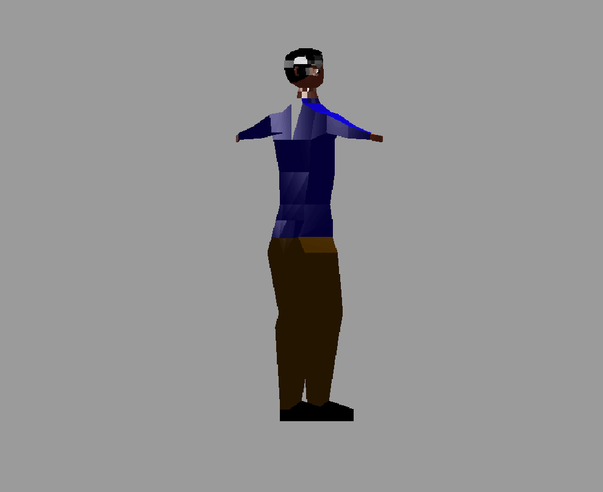

# Rust 3D game test engine (Learning)

### This is only a program for learning, this is not be made to run a "real" game

1. ~~Work only with wavefront obj files~~
2. Doesn't use directly OpenGL, Vulkan or others 3D libraries
3. Without textures
----------------------
## TODO :D
----------------------
- [x] Drawing a cube
- [x] Load Wavefront files
    - [ ] ~~Loading all data~~
    - [x] Ambient, diffuse, specular
    - [x] Vertices
    - [x] Normals
    - [ ] ~~Textures~~
        - [x] ~~Texture image~~
        - [x] ~~Texture Coordinates~~
        - [ ] ~~Understand how to match both~~

- [ ] Find or craft a better 3D model

- [ ] Load gltf/gltb files
    - [x] ~~use easy_gltb~~
    - [x] use an other lib that support animations
    - [ ] load animation data
    - [ ] understand animations

- [x] Understand the translation transformation
- [x] Make rotations

- [x] Lightning
    - [x] Enhance my lightning
        - [x] diffuse 
        - [x] Specular
    - [x] ~~Textures~~
        - [x] Draw texture on cube
        - [ ] ~~Draw it correctly~~
        - [ ] ~~Understand how to draw it correctly~~

    - [x] Ambient, diffuse, specular
    
- [ ] ~~Using GPU instead of CPU~~
- [ ] Moving through the world
    - [x] X axis and Z axis
    - [x] rotate camera
    - [ ] move with rotated camera
----------------------
| Character with camera moving around the object |
| ----------- |
|  |

| Character with camera move (bad conception) |
| ----------- |
|  |

| Two cubes ! |
| ----------- |
|  |

| Airplane test success |
| ---------------- |
|  |

| Both ! |
| ----------- |
|  |

